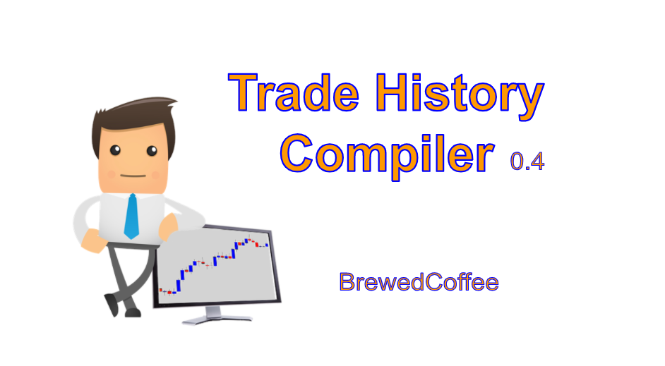

# Trade History Compiler  
by BrewedCoffee

This is a nifty compiler that sorts and calculates capital gains/losses from a text file of trades.  
It can be a handy tool for tax purposes- or just to see how much you've making. Or how much you're losing 😢  on Intel calls.  

  
     
In order to change the time period for CGL calculation, refer to main.cpp.  
The text file should be named trade_history.txt to be recognized.  
Note that the text file can only contain trades of a single ticker. Maybe I'll improve that in the future.
